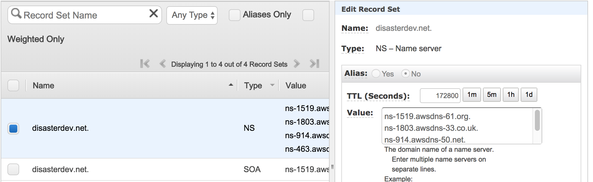
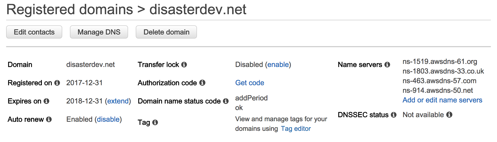

If you're a developer like me, you probably also want to build a blog site to showcase your ideas, skills, lessons and achievements. What if I tell you I built this site without hosting any server and it's worldwide-fast, highly available, and even the building process was almost automated, and even better, the cost is almost nothing? *"That sounds pretty good, now show me how!"* With AWS (I'm not working for their sales team) and laptop, you can do this in one day. Now let me show you how.

<!--more-->

This article will show you how I built this site by leveraging the power of [AWS](https://aws.amazon.com/) and [React](https://reactjs.org/). I assume that you have some knowledge regarding AWS, React, Node, so I'll just focus on the main points. I also assume that you've had an AWS account already.

## How it works
First of all, here's the overview of what I did, just to give you a big picture.

1. I bought the domain (disasterdev.net) directly from AWS [Route53](https://aws.amazon.com/route53/).

1. I used [Gatsby](https://www.gatsbyjs.org/) (**nothing to do with** Leonardo DiCaprio) to generate all the site contents that're ready to be deployed. This article will not discuss how to use this tool, so you'll need to read its documentation, which won't take you much time.

3. I created an [S3](https://aws.amazon.com/s3/) bucket and put the all website files in that bucket. I also turned on the static website hosting for this bucket and set up public read permission.

4. I created a [CloudFront](https://docs.aws.amazon.com/AmazonCloudFront/latest/DeveloperGuide/Introduction.html) distribution which points to the static website URL of the bucket created in step 3 to serve the website to public audience.

5. I created a record set (blog.disasterdev.net) in the hosted zone (disasterdev.net) and pointed it to the domain name of the CloudFront in step 4.

6. I requested an SSL/TLS certificate using [Certificate Manager](https://aws.amazon.com/certificate-manager/) and configured CloudFront distribution in step 4 to use this certificate.

7. One day later, my billing alarm reminded me that I'd spend $600 at the end of this month. On dear, don't worry, because I'd tell you the mistake I made and make sure you'll NEVER have to repeat my mistake, just because I'm such a generous person.

Now, let's stop playing the stupid MMO or watching that R18+ on Netflix - time to do build something!

## 1. Install Gatsby
There's not much to say about this. You need to have [Node](https://nodejs.org/en/) installed. Then, you run the following commands to install this tool and get started.
```
npm install --global gatsby-cli
gatsby new blog
cd blog
gatsby develop
```
You can play around with Gatsby and create some dummy pages. Once you're ready, run `gatsby build` to build it. This will generate all the contents in `/public` folder, that is ready to be deployed.

## 2. Create S3 bucket
Login AWS console and go to S3 service page, where you need to create a bucket that will be used to store all the website files. This is the [CloudFormation](https://aws.amazon.com/cloudformation/) template for the bucket.

```yaml
S3Bucket:
  Type: "AWS::S3::Bucket"
  Properties:
    BucketName: your.blog
```

*"Wait, what the hell is CloudFormation?"* might be your question. It's just a way to automatically provision AWS resources without a thousand times of manual clicks. Whatever you can do with CloudFormation, you can do it via AWS console or CLI as well, so don't let that freak you out, as you're free to choose your way of doing things.

An S3 bucket by default denies all kinds of requests, except the owner's. If we are to host a static website using S3, we need to set up public read permission as mentioned [here](https://docs.aws.amazon.com/AmazonS3/latest/dev/WebsiteAccessPermissionsReqd.html). Open S3 service page and click *Permissions->Bucket Policy* and add the following policy.

```json
{
  "Version": "2008-10-17",
  "Statement": [
    {
      "Effect": "Allow",
      "Principal": {
        "AWS": "*"
      },
      "Action": "s3:GetObject",
      "Resource": "arn:aws:s3:::your.blog/*"
    }
  ]
}
```

And this is the CloudFormation template for both S3 bucket policy.

```yaml
S3BucketPolicy:
  Type: "AWS::S3::BucketPolicy"
  Properties: 
    Bucket: !Ref S3Bucket
    PolicyDocument:
      Statement: 
        - Action: 
            - "s3:GetObject"
          Effect: "Allow"
          Resource: !Join
            - ""
            - - "arn:aws:s3:::"
              - !Ref S3Bucket
              - "/*"
          Principal:
            AWS: "*"
``` 

## 3. Create CloudFront distribution
Instead of using S3 to serve the website directly, we will use CloudFront, because this is a static website and CloudFront provides great speed across the world, thanks to its edge locations.

Login AWS console and go to CloudFront service page, where you can create the CloudFront distribution. Here're some highlights that you need to pay attention to:

- The origin should be the static website endpoiont of the S3 bucket you created in step 2. It'll look like this: *your.blog.s3-website-ap-southeast-2.amazonaws.com*.

- Set the Default Root Object to *index.html* so when user requests the root URL, index page will be automatically displayed.

- For *Alias*, add the domain name which will be the website URL for your end users, for instance, mine is `blog.disasterdev.net`.

At last, your distribution settings will look similar as the screenshot below. There're settings you may not understand yet, for example *SSL Certificate*, which we will talk about later.


## 4. Create record set
I'm gonna assume you've already bought your domain, so if you login AWS console and go to *Route53->Hosted zones*, you should see something similar to this.



The *NS* record set have the name servers for your domain, so make sure they also appear in registered domains like this. If they don't, click *Add or edit name servers* to update them.



Now, you need to add another record set which points the website domain name to CloudFront domain name.

For CloudFront domain name, go to CloudFront service page and find the distribution you just created, which should show you the domain name.

For the record set, click *Go to Record Sets->yourdomain.net->Create Record Set*, and create a record with these properties:

- Name: blog.yourdomain.net
- Type: A - IPv4 address
- Alias: Yes
- Alias Target: d2n3whn1234567.cloudfront.net.
- Alias Hosted Zone ID: Z2FDTNDATAQYW2
- Routing Policy: Simple
- Evaluate Target Health: No

This is the CloudFormation template for the record set.
```yaml
RecourdSet:
  Type : "AWS::Route53::RecordSet"
  Properties:
    Name: "blog.yourdomain.net"
    Comment: "A record for Blog"
    HostedZoneId: "Z3MTVYTKZKL49"
    AliasTarget:
      DNSName: !GetAtt CloudFront.DomainName
      HostedZoneId: Z2FDTNDATAQYW2
    Type: A
```

## 5. Upload your website
By now, we've created S3 bucket, CloudFront distribution, a record set pointing to the CloudFront, and more importantly, connected them together. This allows a request to *blog.yourdomain.net* to be resolved to *abcdefg1234567.cloudfront.net*, which is eventaully routed to your S3 bucket *your.blog.s3-website-ap-southeast-2.amazonaws* - where the actual content lies - AWESOME! It's time to throw some real content into the bucket so users can browse, yeah?

Remember in step 1 we ran `gatsby build` to generate all the website files into `/public` folder? Now you need to upload all the files to the S3 bucket. Please don't be naive to upload them one by one; we should run a command to do this. Install [AWS CLI](https://aws.amazon.com/cli/) and run `aws configure` to configure your AWS credentials properly.

Done? Make sure you're at project root folder, and run `aws s3 sync ./public/ s3://your.blog --storage-class REDUCED_REDUNDANCY --delete`. This will upload all the files in current directory to *your.blog* bucket, and also delete the remote files which don't exist locally anymore - 100% synchronised. Note that I'm using [reduced redundancy](https://aws.amazon.com/s3/reduced-redundancy/) because it's cheaper and even if I lose the files on S3, I can still regenerate all the files using Gatsby and re-upload them to S3 bucket.

Now you open *https://blog.yourdomain.net*. Your site should be running, with one thing bugging you though: your browser complains "This website is NOT secure!".

## 6. Make it secure
Before you go to Certificate Manager service page, make sure you're under region US East (N. Virginia), according to [this article](https://docs.aws.amazon.com/acm/latest/userguide/acm-regions.html): *"To use an ACM Certificate with Amazon CloudFront, you must request or import the certificate in the US East (N. Virginia) region."*.

Click *Request Certificate* and type domain name **.yourdomain.net*. Note that the aterisk will allow us to use this certificate for all domain names of this kind, such as *abc.yourdomain.net*, *batman.yourdomain.net* and so on.

Choose *DNS validation* and follow the instructions to complete the creation wizard. Now you should see a "Pending" certificate. Expand the certificate and you should see a button *Create Route53 Record Set*, clicking which will create a CNAME record in your hosted zone and a few minutes later the "Pending" status will be updated to "Issued".

Phew, almost there! Remember in step 3 I mentioned *SSL Certificate*? Now take a note of the ARN of the certificate you just created. Go back to the CloudFront distribution, and fix its *SSL Certificate* to be this ARN. **Pay attention**: because you're using CloudFront with a custom SSL certificate, it's **VERY IMPORTANT** that you also set *Custom SSL Client Support* to **Only Clients that Support Server Name Indication (SNI)**. Look, I can't stress this enough as I would have spent $600/month (thanks to my billing alarm, I didn't) just because I accidentally chose the wrong option here. Anyway, $600 or $0, the choice is yours.

Give it some time, and it might take more than 10 minutes. Now open *https://blog.yourdomain.net*, and your browser should tell you "Yep, this website is secure!".

## CloudFormation
I'm a big fan of CloudFormation and in reality I used CloudFormation to provision most of the AWS resources I needed for this website, except the hosted zone and certificate. Here's the complete CloudFormation template I wrote (changed a few parameters), which you can borrow to provision your own website if you find clicking in AWS console is such a chore.

```yaml
---
AWSTemplateFormatVersion: '2010-09-09'
Description: Blog resources
Resources:
  S3Bucket:
    Type: "AWS::S3::Bucket"
    Properties:
      BucketName: your.blog
      WebsiteConfiguration:
        IndexDocument: index.html
        ErrorDocument: error.html

  S3BucketPolicy:
    Type: "AWS::S3::BucketPolicy"
    Properties: 
      Bucket: !Ref S3Bucket
      PolicyDocument:
        Statement: 
          - Action: 
              - "s3:GetObject"
            Effect: "Allow"
            Resource: !Join
              - ""
              - - "arn:aws:s3:::"
                - !Ref S3Bucket
                - "/*"
            Principal:
              AWS: "*"

  CloudFront:
    Type: "AWS::CloudFront::Distribution"
    Properties:
      DistributionConfig:
        Aliases:
          - "blog.disasterdev.net"
        Comment: CloudFront for Blog
        Enabled: true
        DefaultCacheBehavior:
          Compress: true
          ForwardedValues:
            QueryString: true
          TargetOriginId: blog-origin
          ViewerProtocolPolicy: redirect-to-https
          DefaultTTL: 3600 # I prefer 1 hour so that my new post can be delivered quickly
        Origins:
          - DomainName: !Join
              - ''
              - - !Ref S3Bucket
                -  ".s3-website-ap-southeast-2.amazonaws.com"
            CustomOriginConfig:
              HTTPPort: 80
              HTTPSPort: 443
              OriginProtocolPolicy: http-only
            Id: blog-origin
        PriceClass: PriceClass_All
        ViewerCertificate:
          AcmCertificateArn: "arn:aws:acm:us-east-1:504224764639:certificate/866de211-1111-1111-1111-db1180e6cddd"
          SslSupportMethod: sni-only # if you set this to vip, you'll be charged $600/month
        DefaultRootObject: "index.html"

  RecourdSet:
    Type : "AWS::Route53::RecordSet"
    Properties:
      Name: "blog.disasterdev.net"
      Comment: "A record for Blog"
      HostedZoneId: "Z3MTVYT123456"
      AliasTarget:
        DNSName: !GetAtt CloudFront.DomainName
        HostedZoneId: Z2FDTNDATAQYW2 # hardcoded, found it here https://docs.aws.amazon.com/AWSCloudFormation/latest/UserGuide/aws-properties-route53-aliastarget.html
      Type: A

```

## Conclusion
It tooke me a few hours to finally get this site up and running properly, but the journey was quite fun. Leveraging the power of AWS, I could host a static website that is highly available and fast for every location in the world costing me little, and all I need was just a laptop and AWS account - tell me how you beat that!

Gatsby is also a brilliant tool that helps you build the website easily with some [best practices](https://www.gatsbyjs.org/docs/prpl-pattern/) embeded.

All in all, I had a lot fun building this and I hope you will do too.