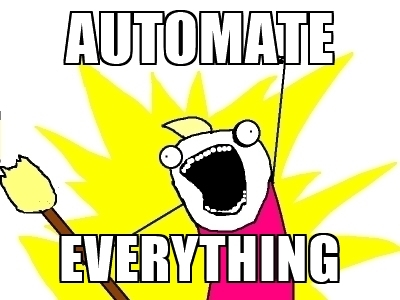
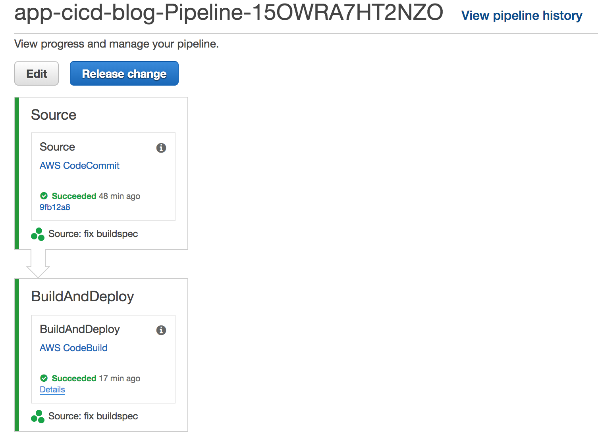

If you gave me face and read [Build your ultimate blog with React, S3, CloudFront and Route53](/build-your-ultimate-blog-with-react-s3-cloudfront-and-route53/), then you know how *badass* this website is already. But young man, we're not done yet, because as a developer, we want to



So in this article I'm gonna talk about how I provisioned CICD pipeline to build and deploy this website.

What automation are we talking about? It's quite straightforward:
1. I pushed the source files, including all the articles to a Git service, such as GitHub.
2. I built an AWS CodeBuild project which takes in the source files of this website, builds it, and sync the built files to the S3 bucket hosting the website.
3. I built an AWS CodePipeline which automatically pulls the source files from Git and passes them down to CodeBuild project, which does the build and deployment.

<!--more-->

And that's it - simply 3 steps!

## Host source files
I chose to host my source in AWS CodeCommit. *"Why not GitHub?"*, you're asking. I guess for one, I'm too shy to share my terrible source code to everyone. Also, CodeCommit is seamlessly integrated with AWS CodePipeline, that is one of the main services I use for this CICD. See? They really know how to make you stick to AWS.

So I logged in AWS console, went to CodeCommit service page and created a repository called *blog*. Following the instructions, I also set up my *CodeCommit Credentials*.

With some basic AWS and Git knowledge, I got my source files checked in very quickly.

## Build CodeBuild
Instead of provisioning and hosting your own build server, you can set up a CodeBuild project, which can be seen as a *serverless* (another fancy buzz word eh?) build machine that is provisioned by AWS on the fly when your build starts. This "serverless build machine" will execute build commands in `buildspec.yml` file, which should be put under the project root folder.

For example, this is my `buildspec.yml` file.

```yaml
version: 0.1

phases:
  build:
    commands:
      - echo "Starting build `date` in `pwd`"
      - npm install
      - npm run aws-build
  post_build:
    commands:
      - echo "build completed on `date`"
```

I did two things in this file:
1. I run `npm install` to install all the dependencies.
2. I run `npm run aws-build` to make a build and sync the built files to S3.

Let me show you the magic of `aws-build` in `package.json`:

```json
{
  "scripts": {
    "sync-s3": "aws s3 sync public/. s3://my.blog --storage-class REDUCED_REDUNDANCY --delete",
    "aws-build": "npm run build && npm run sync-s3",
  }
}
```

In `aws-build` I first call `npm run build` to build the whole website and then I run `sync-s3` to synchronise all the files under `public/` directory to S3 bucket `my.blog`.

I didn't go to CodeBuild service page because smart developers **automate everything**. I'm just going to pretend I'm smart here. Here's the CloudFormation template to automate the provisioning.

```yaml
ArtifactBucket:
  Type: "AWS::S3::Bucket"

CodeBuildServiceRole:
  Type: "AWS::IAM::Role"
  Properties:
    Path: "/"
    AssumeRolePolicyDocument:
      Statement:
        - Effect: Allow
          Principal:
            Service:
              - codebuild.amazonaws.com
          Action:
            - sts:AssumeRole
    ManagedPolicyArns:
      - arn:aws:iam::aws:policy/AWSCodeCommitFullAccess
    Policies:
      - PolicyName: CodeBuildAccess
        PolicyDocument:
          Statement:
            - Resource: "*"
              Effect: Allow
              Action: logs:*
            - Resource: !Sub arn:aws:s3:::${ArtifactBucket}/*
              Effect: Allow
              Action:
                - s3:GetObject
                - s3:PutObject
                - s3:GetObjectVersion
            - Resource: "*"
              Effect: Allow
              Action: s3:List*
            - Resource: arn:aws:s3:::ktei2008.blog/*
              Effect: Allow
              Action:
                - s3:GetObject
                - s3:PutObject
                - s3:DeleteObject*

CodeBuildProject:
  Type: "AWS::CodeBuild::Project"
  Properties:
    Name: BlogBuildAndDeploy
    Artifacts:
      Type: S3
      Location: !Ref ArtifactBucket
    Source:
      Type: CODECOMMIT
      Location: https://git-codecommit.ap-southeast-2.amazonaws.com/v1/repos/blog
    Environment:
      ComputeType: BUILD_GENERAL1_SMALL
      Image: aws/codebuild/nodejs:7.0.0
      Type: LINUX_CONTAINER
    ServiceRole: !Ref CodeBuildServiceRole
```

A few things to notice here about CodeBuild:
- It needs certain permissions to synchronise built files to the blog bucket.
- I set its *Environment->Image* to be `aws/codebuild/nodejs:7.0.0` because Gatsby is a  framework running on Node. There're [many images](https://docs.aws.amazon.com/codebuild/latest/userguide/build-env-ref-available.html) you can choose from. You can even provision your own image.
- *ComputeType* is set to *BUILD_GENERAL1_SMALL* because I'm a cheapskate. If you think the build is too slow, upgrade this to *BUILD_GENERAL1_LARGE* and it's usually much faster.

## Build CodePipeline
I've got all the pieces ready so it's time to connect the dots. CodePipeline is perfect for this. I can create a CodePipeline and have 2 stages, the first of which is triggered whenever I push changes to CodeCommit repository. The first stage will clone the repository and put it in an artifacts S3 bucket, waiting for the CodeBuild in stage 2 to pick the source up.

In stage 2 I use CodeBuild to run `gatsby build` and synchronise built files to the blog bucket.

The final pipeline I created looks like this:



And this is the CloudFormation template I used to create the pipeline.

```yaml
CodePipelineServiceRole:
  Type: "AWS::IAM::Role"
  Properties:
    Path: "/"
    AssumeRolePolicyDocument:
      Statement:
        - Effect: Allow
          Principal:
            Service:
              - codepipeline.amazonaws.com
          Action:
            - sts:AssumeRole
    ManagedPolicyArns:
      - arn:aws:iam::aws:policy/AWSCodeCommitFullAccess
    Policies:
      - PolicyName: CodePipelineAccess
        PolicyDocument:
          Statement:
            - Resource: "*"
              Effect: Allow
              Action:
                - iam:PassRole
            - Resource: !GetAtt CodeBuildProject.Arn
              Effect: Allow
              Action:
                - codebuild:StartBuild
                - codebuild:BatchGetBuilds
            - Resource: !Sub arn:aws:s3:::${ArtifactBucket}/*
              Effect: Allow
              Action:
                - s3:*

Pipeline:
  Type: "AWS::CodePipeline::Pipeline"
  Properties:
    RoleArn: !GetAtt CodePipelineServiceRole.Arn
    ArtifactStore:
      Type: S3
      Location: !Ref ArtifactBucket
    Stages:
      - Name: Source
        Actions:
          - Name: Source
            ActionTypeId:
              Category: Source
              Owner: AWS
              Version: 1
              Provider: CodeCommit
            Configuration:
              RepositoryName: blog
              BranchName: master
            OutputArtifacts:
              - Name: Source

      - Name: BuildAndDeploy
        Actions:
          - Name: BuildAndDeploy
            ActionTypeId:
              Category: Build
              Owner: AWS
              Version: 1
              Provider: CodeBuild
            Configuration:
              ProjectName: !Ref CodeBuildProject
            InputArtifacts:
              - Name: Source
```

Now I've built a simple CICD pipeline for my own website. This frees me up as I don't need to worry about deployment anymore, while I can focus on wrting more bad or worse articles to ~~mislead~~ help you - disaster dev eh?

# Conclusion
With the help of AWS CodeCommit, CodeBuild and CodePipeline, I managed to create a smooth CICD experience for my own website and it costs me little. We all want to be smart devs, and smart devs are usually lazy bastards - because they've automated everything for themselves! Don't you wanna be one of them?
