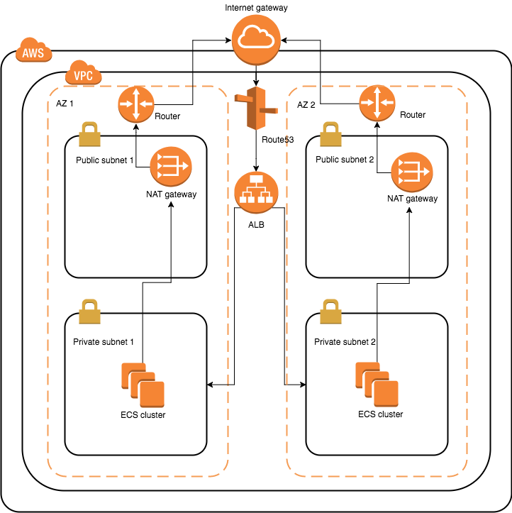

AWS is an enormous jungle. It has more than 50 services, the number of which keeps increasing every year. For beginners like myself, it's pretty easy to get lost in this jungle. Thanks to my terrible memory, I think it's useful for me to write down this blog to showcase how I built a simple AWS infrastructure using CloudFormation, and deployed a container on ECS, just in case I forget one day.

<!--more-->

First of all, I truly believe that *everything that can be automated should be automated*, so CloudFormation is going to be my main tool to provision the infrastructure. In fact, it's one of the two services (another is AWS Lambda) that really got me into AWS.

So what I built here is a simple cloud infrastructure in which there're VPC, subnets, load balancer, ECS clusters so on so forth. This infrastructure allows you to deploy containers on ECS clusters which is secure to some extent, and highly available.

In short, here is a poorly drawn diagram to illustrate what I built in a high level. I used [draw.io](https://www.draw.io/) to draw this and it actually costed me some effort so don't you judge it!



## Infrastructure
To make my infrastructure highly availalbe, I choose to use 2 available zones - which I'll call AZ1 and AZ2 just for simplicity. I divide each zone into 3 subnets, although from the diagram you can only see 2.

### Public subnet
The Internet facing subnet (my [DMZ](https://en.wikipedia.org/wiki/DMZ_(computing))), which I call public subnet is where I put things like *jumpbox* or *NAT gateway*. Any EC2 instance I deploy in this subnet will automatically have an assigned public IP, which means if I open port 22 through its security groups, I can SSH to the terminal from the Internet. As you can imagine, this is not a good place for your application servers, as this is the front line between the evil world and your happy private paradise, so we need to leave our servers and databases out of this area. However, this is the right place for everything that should be public facing, such as NAT gateway.

### Service subnet
This is where I deploy my ECS clusters. The idea is that only load balancer can forward the requests from public subnets to these clusters, so all I need to do is to allow ALB (application load balancer) to hit the clusters. I can achieve this by creating a security group for ALB to listen to Internet requests on port 443, and then attaching a security group on clusters, which grants the inbound access for instances belonging to ALB security group, which is the ALB itself.

Another caveat I encountered was that to register EC2 instances to a ECS cluster, those instances need to have public IPs. If you think about it, instances in private subnets don't have public IPs, so that seems like a conflict now? Not really, because you can put a NAT gateway - well, technically 2 for high availability - in public subnets, and then add a route *0.0.0.0/0->NAT* for the instances, so outgoing traffic will all go through the NAT gateway, which will translate their private IPs into public IPs, so that ECS agents can work properly.

### Application load balancer
There's not much to say about this but do understand one thing, that the traffic between the ALB and the ECS clusters may or may not be secure, which is totally up to how you implement your services. You can force the HTTP encryption between ALB and ECS, but that requires your web server - kestrel (.NET Core) for example - to be able to decrypt the traffic, given the SSL/TLS certificate. However, if your application server cannot decrypt it, then you can't encrypt the traffic, otherwise nothing works.

### Data subnet
This is something I left for future. At the moment I'm not planning to run any RDS (they're indeed way more expensive than small EC2 instances). But as the name suggests, this is where you put data servers. ALB should not have access to this area. In fact, this subnet should be mostly protected as it's the place for your data, which has not public facing responsibility. If somehow this area is compromised, you'll be in trouble.

### Spot instance
I chose to run spot instances for ECS clusters, as they're way cheaper than on-demand instances. Beause I'm not running any commercial website, I can just put a very low bid price there hoping that the price will always be slightly higher than spot instance price, which will keep all my instances running. In fact, I use spot instances in my company for test environment and the website went down ever since. It makes a lot sense to do this especially when you run small business or startup, in which you want to save every cent of your money but also enjoy the power that AWS brings to you, so spot instance is a fine choice fro you.

## CloudFormation
So far you should understand the infrastructure from a high level. Now it's time to build it. With CloudFormation, I can deploy the whole infrastructure without endless cliking in AWS console, so here're the templates I used to provision my infrastructure. You can read them and reuse them or roll your own, so let's have a look.

With the CloudFormation templates below, I built the infrastructure depicted in the diagram. If you want to reuse them, make sure you run them in such correct sequence and use the stack name I provided here:

- infra-vpc
- infra-sgs
- infra-alb
- infra-ecs-cluster

### VPC - (infra-vpc)

This template built VPC where 6 subnets (public subnets, service subnets and data subnets) exist. I added a parameter `EnableNat` which controls whether or not I build NAT gateways as I don't want to run NAT gateways for personal AWS account - it costs money!

```yaml
---
AWSTemplateFormatVersion: 2010-09-09

Description: VPC and subnets

Parameters:
  VpcCidr:
    Type: String
    AllowedPattern: '^(?:(?:25[0-5]|2[0-4][0-9]|[01]?[0-9][0-9]?)\.){3}(?:25[0-5]|2[0-4][0-9]|[01]?[0-9][0-9]?)\/(?:2[0-8]|1[6-9])$'
    Description: CIDR for VPC
    Default: 10.0.61.0/22

  EnableNat:
    Type: String
    Description: Whether to create NAT gateways for private subnets
    Default: false

  PublicSubnet1Cidr:
    Type: String
    AllowedPattern: '^(?:(?:25[0-5]|2[0-4][0-9]|[01]?[0-9][0-9]?)\.){3}(?:25[0-5]|2[0-4][0-9]|[01]?[0-9][0-9]?)\/(?:2[0-8]|1[6-9])$'
    Description: CIDR for public subnet 1
    Default: 10.0.61.0/26

  PublicSubnet2Cidr:
    Type: String
    AllowedPattern: '^(?:(?:25[0-5]|2[0-4][0-9]|[01]?[0-9][0-9]?)\.){3}(?:25[0-5]|2[0-4][0-9]|[01]?[0-9][0-9]?)\/(?:2[0-8]|1[6-9])$'
    Description: CIDR for public subnet 2
    Default: 10.0.61.64/26

  ServiceSubnet1Cidr:
    Type: String
    AllowedPattern: '^(?:(?:25[0-5]|2[0-4][0-9]|[01]?[0-9][0-9]?)\.){3}(?:25[0-5]|2[0-4][0-9]|[01]?[0-9][0-9]?)\/(?:2[0-8]|1[6-9])$'
    Description: CIDR for service (private) subnet 1
    Default: 10.0.62.0/26

  ServiceSubnet2Cidr:
    Type: String
    AllowedPattern: '^(?:(?:25[0-5]|2[0-4][0-9]|[01]?[0-9][0-9]?)\.){3}(?:25[0-5]|2[0-4][0-9]|[01]?[0-9][0-9]?)\/(?:2[0-8]|1[6-9])$'
    Description: CIDR for service (private) subnet 2
    Default: 10.0.62.64/26

  DataSubnet1Cidr:
    Type: String
    AllowedPattern: '^(?:(?:25[0-5]|2[0-4][0-9]|[01]?[0-9][0-9]?)\.){3}(?:25[0-5]|2[0-4][0-9]|[01]?[0-9][0-9]?)\/(?:2[0-8]|1[6-9])$'
    Description: CIDR for data (private) subnet 1
    Default: 10.0.63.0/26

  DataSubnet2Cidr:
    Type: String
    AllowedPattern: '^(?:(?:25[0-5]|2[0-4][0-9]|[01]?[0-9][0-9]?)\.){3}(?:25[0-5]|2[0-4][0-9]|[01]?[0-9][0-9]?)\/(?:2[0-8]|1[6-9])$'
    Description: CIDR for data (private) subnet 2
    Default: 10.0.63.64/26

Conditions:
  EnableNat: !Equals [ !Ref EnableNat, "true" ]

Resources:
  Vpc:
    Type: AWS::EC2::VPC
    Properties:
      CidrBlock: !Ref VpcCidr
      Tags:
        - Key: Name
          Value: !Sub ${AWS::StackName}::Vpc

  InternetGateway:
    Type: AWS::EC2::InternetGateway
    Properties:
      Tags:
        - Key: Name
          Value: !Sub ${AWS::StackName}::InternetGateway

  InternetGatewayVpcAttachment:
    Type: AWS::EC2::VPCGatewayAttachment
    Properties:
      VpcId: !Ref Vpc
      InternetGatewayId: !Ref InternetGateway

  NatGatewayAz1:
    Type: AWS::EC2::NatGateway
    Condition: EnableNat
    DependsOn: InternetGatewayVpcAttachment
    Properties:
      AllocationId: !GetAtt NatEipAz1.AllocationId
      SubnetId: !Ref PublicSubnet1

  NatEipAz1:
    Type: AWS::EC2::EIP
    Condition: EnableNat
    DependsOn: InternetGatewayVpcAttachment
    Properties:
      Domain: vpc

  PublicSubnet1:
    Type: AWS::EC2::Subnet
    Properties:
      VpcId: !Ref Vpc
      AvailabilityZone: !Select 
        - 0
        - Fn::GetAZs: !Ref AWS::Region
      CidrBlock: !Ref PublicSubnet1Cidr
      MapPublicIpOnLaunch: true
      Tags:
        - Key: Name
          Value: !Sub ${AWS::StackName}::PublicSubnet1

  PublicSubnet2:
    Type: AWS::EC2::Subnet
    Properties:
      VpcId: !Ref Vpc
      AvailabilityZone: !Select 
        - 1
        - Fn::GetAZs: !Ref AWS::Region
      CidrBlock: !Ref PublicSubnet2Cidr
      MapPublicIpOnLaunch: true
      Tags:
        - Key: Name
          Value: !Sub ${AWS::StackName}::PublicSubnet2

  PublicSubnetsRouteTable:
    Type: AWS::EC2::RouteTable
    Properties:
      VpcId: !Ref Vpc
      Tags:
        - Key: Name
          Value: !Sub ${AWS::StackName}::PublicSubnetsRouteTable

  PublicSubnet1Association:
    Type: AWS::EC2::SubnetRouteTableAssociation
    Properties:
      RouteTableId: !Ref PublicSubnetsRouteTable
      SubnetId: !Ref PublicSubnet1

  PublicSubnet2Association:
    Type: AWS::EC2::SubnetRouteTableAssociation
    Properties:
      RouteTableId: !Ref PublicSubnetsRouteTable
      SubnetId: !Ref PublicSubnet2

  PublicSubnetsInternetGatewayRoute:
    Type: AWS::EC2::Route
    DependsOn: InternetGatewayVpcAttachment
    Properties:
      RouteTableId: !Ref PublicSubnetsRouteTable
      DestinationCidrBlock: 0.0.0.0/0
      GatewayId: !Ref InternetGateway    

  ServiceSubnet1:
    Type: AWS::EC2::Subnet
    Properties:
      VpcId: !Ref Vpc
      AvailabilityZone: !Select 
        - 0
        - Fn::GetAZs: !Ref AWS::Region
      CidrBlock: !Ref ServiceSubnet1Cidr
      Tags:
        - Key: Name
          Value: !Sub ${AWS::StackName}::ServiceSubnet1

  ServiceSubnet2:
    Type: AWS::EC2::Subnet
    Properties:
      VpcId: !Ref Vpc
      AvailabilityZone: !Select 
        - 1
        - Fn::GetAZs: !Ref AWS::Region
      CidrBlock: !Ref ServiceSubnet2Cidr
      Tags:
        - Key: Name
          Value: !Sub ${AWS::StackName}::ServiceSubnet2

  ServiceSubnetsRouteTable:
    Type: AWS::EC2::RouteTable
    Properties:
      VpcId: !Ref Vpc
      Tags:
        - Key: Name
          Value: !Sub ${AWS::StackName}::ServiceSubnetsRouteTable

  ServiceSubnet1Association:
    Type: AWS::EC2::SubnetRouteTableAssociation
    Properties:
      RouteTableId: !Ref ServiceSubnetsRouteTable
      SubnetId: !Ref ServiceSubnet1

  ServiceSubnet2Association:
    Type: AWS::EC2::SubnetRouteTableAssociation
    Properties:
      RouteTableId: !Ref ServiceSubnetsRouteTable
      SubnetId: !Ref ServiceSubnet2

  ServiceSubnetsNatGatewayAz1Route:
    Type: AWS::EC2::Route
    Condition: EnableNat
    Properties:
      RouteTableId: !Ref ServiceSubnetsRouteTable
      DestinationCidrBlock: 0.0.0.0/0
      NatGatewayId: !Ref NatGatewayAz1

  DataSubnet1:
    Type: AWS::EC2::Subnet
    Properties:
      VpcId: !Ref Vpc
      AvailabilityZone: !Select 
        - 0
        - Fn::GetAZs: !Ref AWS::Region
      CidrBlock: !Ref DataSubnet1Cidr
      Tags:
        - Key: Name
          Value: !Sub ${AWS::StackName}::DataSubnet1

  DataSubnet2:
    Type: AWS::EC2::Subnet
    Properties:
      VpcId: !Ref Vpc
      AvailabilityZone: !Select 
        - 1
        - Fn::GetAZs: !Ref AWS::Region
      CidrBlock: !Ref DataSubnet2Cidr
      Tags:
        - Key: Name
          Value: !Sub ${AWS::StackName}::DataSubnet2

  DataSubnetsRouteTable:
    Type: AWS::EC2::RouteTable
    Properties:
      VpcId: !Ref Vpc
      Tags:
        - Key: Name
          Value: !Sub ${AWS::StackName}::DataSubnetsRouteTable

  DataSubnet1Association:
    Type: AWS::EC2::SubnetRouteTableAssociation
    Properties:
      RouteTableId: !Ref DataSubnetsRouteTable
      SubnetId: !Ref DataSubnet1

  DataSubnet2Association:
    Type: AWS::EC2::SubnetRouteTableAssociation
    Properties:
      RouteTableId: !Ref DataSubnetsRouteTable
      SubnetId: !Ref DataSubnet2

  DataSubnetsNatGatewayAz1Route:
    Type: AWS::EC2::Route
    Condition: EnableNat
    Properties:
      RouteTableId: !Ref DataSubnetsRouteTable
      DestinationCidrBlock: 0.0.0.0/0
      NatGatewayId: !Ref NatGatewayAz1

Outputs:
  VpcId:
    Description: VPC ID
    Value: !Ref Vpc
    Export:
      Name: !Sub ${AWS::StackName}::VpcId

  VpcCidr:
    Description: VPC CIDR
    Value: !Ref VpcCidr
    Export:
      Name: !Sub ${AWS::StackName}::VpcCidr
  
  PublicSubnet1Id:
    Description: Public subnet 1 ID
    Value: !Ref PublicSubnet1
    Export:
      Name: !Sub ${AWS::StackName}::PublicSubnet1Id

  PublicSubnet1Cidr:
    Description: Public subnet 1 CIDR
    Value: !Ref PublicSubnet1Cidr
    Export:
      Name: !Sub ${AWS::StackName}::PublicSubnet1Cidr

  PublicSubnet2Id:
    Description: Public subnet 2 ID
    Value: !Ref PublicSubnet2
    Export:
      Name: !Sub ${AWS::StackName}::PublicSubnet2Id

  PublicSubnet2Cidr:
    Description: Public subnet 2 CIDR
    Value: !Ref PublicSubnet2Cidr
    Export:
      Name: !Sub ${AWS::StackName}::PublicSubnet2Cidr

  ServiceSubnet1Id:
    Description: Service subnet 1 ID
    Value: !Ref ServiceSubnet1
    Export:
      Name: !Sub ${AWS::StackName}::ServiceSubnet1Id

  ServiceSubnet1Cidr:
    Description: Service subnet 1 CIDR
    Value: !Ref ServiceSubnet1Cidr
    Export:
      Name: !Sub ${AWS::StackName}::ServiceSubnet1Cidr

  ServiceSubnet2Id:
    Description: Service subnet 2 ID
    Value: !Ref ServiceSubnet2
    Export:
      Name: !Sub ${AWS::StackName}::ServiceSubnet2Id

  ServiceSubnet2Cidr:
    Description: Service subnet 2 CIDR
    Value: !Ref ServiceSubnet2Cidr
    Export:
      Name: !Sub ${AWS::StackName}::ServiceSubnet2Cidr

  DataSubnet1Id:
    Description: Data subnet 1 ID
    Value: !Ref DataSubnet1
    Export:
      Name: !Sub ${AWS::StackName}::DataSubnet1Id

  DataSubnet1Cidr:
    Description: Data subnet 1 CIDR
    Value: !Ref DataSubnet1Cidr
    Export:
      Name: !Sub ${AWS::StackName}::DataSubnet1Cidr

  DataSubnet2Id:
    Description: Data subnet 2 ID
    Value: !Ref DataSubnet2
    Export:
      Name: !Sub ${AWS::StackName}::DataSubnet2Id

  DataSubnet2Cidr:
    Description: Data subnet 2 CIDR
    Value: !Ref DataSubnet2Cidr
    Export:
      Name: !Sub ${AWS::StackName}::DataSubnet2Cidr
```

### Shared security groups - (infra-sgs)

I usually define some shared security groups for other resources to share.

```yaml
---
AWSTemplateFormatVersion: 2010-09-09

Description: Shared security groups

Resources:
  DefaultIngressSg:
    Type: AWS::EC2::SecurityGroup
    Properties:
      GroupDescription: SSH access across the VPC
      VpcId: !ImportValue infra-vpc::VpcId
      SecurityGroupIngress:
        - IpProtocol: icmp
          FromPort: 8
          ToPort: 8
          CidrIp: !ImportValue infra-vpc::VpcCidr
        - IpProtocol: tcp
          FromPort: 22
          ToPort: 22
          CidrIp: !ImportValue infra-vpc::VpcCidr
      Tags:
        - Key: Name
          Value: !Sub ${AWS::StackName}::DefaultIngressSg

Outputs:
  DefaultIngressSgId:
    Description: Default ingress security group id
    Value: !Ref DefaultIngressSg
    Export:
      Name: !Sub ${AWS::StackName}::DefaultIngressSgId
```

### ALB - (infra-alb)

```yaml
---
AWSTemplateFormatVersion: 2010-09-09

Description: Application load balancer

Parameters:
  CertificateArn:
    Type: String
    Description: The ARN of the SSL/TLS certificate for ALB port 443 listener
    Default: arn:aws:acm:ap-southeast-2:504224764639:certificate/ce5a2456-f97b-49ed-91fd-323b0e290fb8

Resources:
  LoadBalancer:
    Type: AWS::ElasticLoadBalancingV2::LoadBalancer
    Properties:
      Subnets:
        - !ImportValue infra-vpc::PublicSubnet1Id
        - !ImportValue infra-vpc::PublicSubnet2Id
      SecurityGroups:
        - !Ref LoadBalancerSg
      Tags:
        - Key: Name
          Value: !Sub ${AWS::StackName}::LoadBalancer

  LoadBalancerSg:
    Type: AWS::EC2::SecurityGroup
    Properties:
      GroupDescription: Public access to ALB
      VpcId: !ImportValue infra-vpc::VpcId
      SecurityGroupIngress:
        - CidrIp: 0.0.0.0/0
          IpProtocol: tcp
          FromPort: 443
          ToPort: 443
      Tags:
        - Key: Name
          Value: !Sub ${AWS::StackName}::LoadBalancerSg
  
  # We're not going to use the default group but we need this to create ALB
  DefaultTargetGroup:
    Type: AWS::ElasticLoadBalancingV2::TargetGroup
    Properties:
      Port: 80
      Protocol: HTTP
      VpcId: !ImportValue infra-vpc::VpcId
      Tags:
        - Key: Name
          Value: !Sub ${AWS::StackName}::DefaultTargetGroup

  LoadBalancerListener:
    Type: AWS::ElasticLoadBalancingV2::Listener
    Properties:
      LoadBalancerArn: !Ref LoadBalancer
      Port: 443
      Protocol: HTTPS
      Certificates:
        - CertificateArn: !Ref CertificateArn
      DefaultActions:
        - TargetGroupArn: !Ref DefaultTargetGroup
          Type: forward

Outputs:
  LoadBalancerListenerArn:
    Value: !Ref LoadBalancerListener
    Export:
      Name: !Sub ${AWS::StackName}::LoadBalancerListenerArn

  LoadBalancerSgId:
    Value: !Ref LoadBalancerSg
    Export:
      Name: !Sub ${AWS::StackName}::LoadBalancerSgId

```

### ECS cluster (infra-ecs-cluster)

Here's the how I provisioned an ECS cluster based on a spot fleet request. Notice that here I put EC2 instances in public subnets, which is not best practice in terms of security, but it saves me money as otherwise I need to put NAT gateways in public subnets so that my EC2 instances in private subnets can have public IPs for ECS agents to talk to ECS service.

```yaml
---
AWSTemplateFormatVersion: 2010-09-09

Description: ECS cluster of spot fleet

Parameters:
  ClusterName:
    Type: String
    Description: Name of the ECS cluster
    Default: ApplicationCluster

  TargetCapacity:
    Type: Number
    Description: How many EC2 instances do we want
    Default: 1 # HA needs at least 2

  InstanceType:
    Type: String
    AllowedValues:
      - t2.micro
    Description: EC2 instance type to use for ECS cluster
    Default: t2.micro

  KeyName:
    Type: AWS::EC2::KeyPair::KeyName
    Description: Name of an existing EC2 KeyPair to enable SSH access to the EC2 instances
    Default: default-keypair

  SpotBidPrice:
    Type: String
    Description: Maximum price that you are willing to pay per hour per instance
    Default: 0.0035

Mappings:
  AWSRegionToECSAMI:
    ap-northeast-1:
      AMI: ami-af46dbc9
    ap-southeast-1:
      AMI: ami-fec3b482
    ap-southeast-2:
      AMI: ami-b88e7cda
    ca-central-1:
      AMI: ami-e8cb4e8c
    eu-central-1:
      AMI: ami-b378e8dc
    eu-west-1:
      AMI: ami-7827b301
    eu-west-2:
      AMI: ami-acd5cdc8
    us-east-1:
      AMI: ami-13401669
    us-east-2:
      AMI: ami-901338f5
    us-west-1:
      AMI: ami-b3adacd3
    us-west-2:
      AMI: ami-9a02a9e2

Resources:
  EcsCluster:
    Type: AWS::ECS::Cluster
    Properties:
      ClusterName: !Ref ClusterName

  EcsHostSg:
    Type: AWS::EC2::SecurityGroup
    Properties:
      VpcId: !ImportValue infra-vpc::VpcId
      GroupDescription: Access to the ECS hosts and the tasks/containers that run on them
      SecurityGroupIngress:
        # allow free access for ALB
        - IpProtocol: "-1"
          SourceSecurityGroupId: !ImportValue infra-alb::LoadBalancerSgId
        # SSH for jumpbox
        - IpProtocol: tcp
          FromPort: 22
          ToPort: 22
          CidrIp: !ImportValue infra-vpc::VpcCidr
      Tags:
        - Key: Name
          Value: !Sub ${AWS::StackName}::EcsHostSg

  SpotFleet:
    Type: AWS::EC2::SpotFleet
    DependsOn:
      - SpotFleetRole
      - SpotFleetInstanceProfile
      - EcsHostSg
      - EcsCluster
    Properties:
      SpotFleetRequestConfigData:
        AllocationStrategy: lowestPrice
        IamFleetRole: !GetAtt SpotFleetRole.Arn
        LaunchSpecifications:
          - IamInstanceProfile:
              Arn: !GetAtt SpotFleetInstanceProfile.Arn
            ImageId: !FindInMap [AWSRegionToECSAMI, !Ref "AWS::Region", AMI]
            InstanceType: !Ref InstanceType
            KeyName: !Ref KeyName
            Monitoring:
              Enabled: true
            SecurityGroups:
              - GroupId: !Ref EcsHostSg
              - GroupId: !ImportValue infra-sgs::DefaultIngressSgId

            # EC2 instances need to have public IPs to register ECS:
            # https://stackoverflow.com/questions/31036600/why-cant-my-ecs-service-register-available-ec2-instances-with-my-elb
            # I can either use public subnets, which is not best security practice, but it saves
            # me money from running NAT gateways.
            # Or, I can use service subnets, which is better practice, but I need to run NAT gateways.
            SubnetId: !Join
              - ','
              - - !ImportValue infra-vpc::PublicSubnet1Id
                - !ImportValue infra-vpc::PublicSubnet2Id

            UserData:
              "Fn::Base64": !Sub |
                #!/bin/bash
                yum install -y aws-cfn-bootstrap
                echo ECS_CLUSTER=${EcsCluster} >> /etc/ecs/ecs.config
        SpotPrice: !Ref SpotBidPrice
        TargetCapacity: !Ref TargetCapacity
        TerminateInstancesWithExpiration: true

  SpotFleetInstanceProfile:
    Type: AWS::IAM::InstanceProfile
    DependsOn:
      - SpotFleetInstanceRole
    Properties:
      Path: /
      Roles:
        - Ref: SpotFleetInstanceRole

  SpotFleetInstanceRole:
    Type: AWS::IAM::Role
    Properties:
      AssumeRolePolicyDocument:
        Version: 2012-10-17
        Statement:
          - Action:
              - sts:AssumeRole
            Effect: Allow
            Principal:
              Service:
                - ec2.amazonaws.com
      ManagedPolicyArns:
        - arn:aws:iam::aws:policy/service-role/AmazonEC2ContainerServiceforEC2Role
      Path: /

  SpotFleetRole:
    Type: AWS::IAM::Role
    Properties:
      AssumeRolePolicyDocument:
        Version: 2012-10-17
        Statement:
          - Action:
            - sts:AssumeRole
            Effect: Allow
            Principal:
              Service:
                - spotfleet.amazonaws.com
      ManagedPolicyArns:
        - arn:aws:iam::aws:policy/service-role/AmazonEC2SpotFleetRole
      Path: /

Outputs:
  EcsClusterName:
    Value: !Ref ClusterName
    Export:
      Name: !Sub ${AWS::StackName}::EcsClusterName
```

## Conclusion
This is not the final conclusion yet, but so far you can basically understand what I built and why I built in such way. Also, by reading these boring CloudFormation templates (to prove that your life is probably as boring as mine), you'll have an even better understanding about AWS infrastructure and its automation. Anyway, this is part 1 and now let's take a break and to be continued...